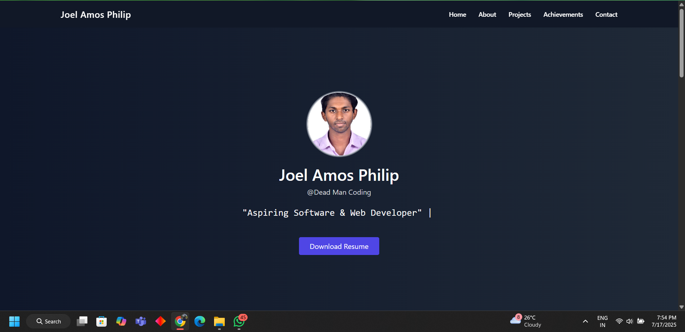

# My Portfolio – DevTown Bootcamp Project Journey

Hey there! 👋

This portfolio website was built as part of the **Tailwind CSS Bootcamp conducted by DevTown**, and honestly — joining this bootcamp was one of the best decisions I made in my developer journey.

At that time, I had just begun learning **HTML**, **CSS**, and **JavaScript**, and I had built a few **basic webpages** on my own. I was *right at the edge* of diving into React — uncertain, curious, and a bit overwhelmed.

Then came the **DevTown Bootcamp**, and it gave me the exact direction I needed.

---

### 💡 What Helped Me Most

This wasn’t just about learning Tailwind CSS — it was about unlocking a new way of building and designing. The **utility-first approach** gave me real-time flexibility and control. The sessions were crisp, well-paced, and beginner-friendly — and helped me understand design with structure.

Suddenly, things that felt *intimidating* began to make sense.

---

### 🔨 Tech Stack

* **HTML5**
* **Tailwind CSS**
* Font Awesome (for professional icons)
* Devicon (for tech skill logos)
* [readme-typing-svg](https://github.com/DenverCoder1/readme-typing-svg) (for that dynamic tagline!)

---

### 😅 Challenges I Faced

Like any good project, this one wasn’t without a few hurdles:

* Favicon and font icon bugs on different browsers
* Getting Font Awesome and devicon to work together cleanly
* Mobile responsiveness and section spacing
* Making things look professional without overdesigning

Every bug taught me something new — and I feel way more confident now.

---

### 🌟 What I Enjoyed

The moment you see your landing section sit perfectly, or the gradient blend just right… you feel proud. Every small detail felt like a win. It was more than just a “portfolio project” — it became **my space** on the web.

---

### 🙏 A Huge Thanks

I want to sincerely thank **Anshul Sir** and the **DevTown Team** for conducting this bootcamp at just the right time for me.

Your mentorship, clarity, and positive energy helped me grow immensely — not just in code, but in confidence.

This project stands as proof of what a few days of focused learning and the right guidance can do. 🚀

---

> To anyone reading this: Learn with intent. Build with love. And trust the process.

– **Joel Amos Philip**
